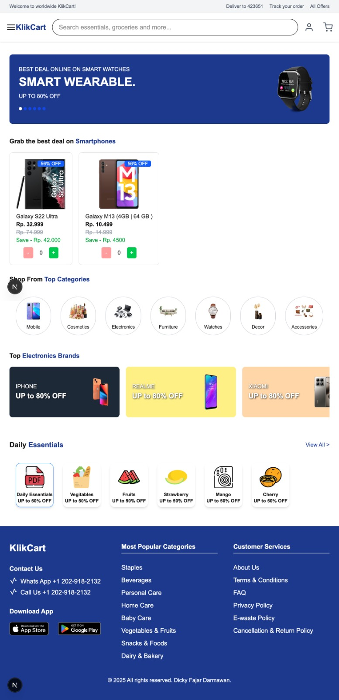

# Klik Cart
dashboard ecommerce dengan next js

## 🚀 About The Project
cuman buat latihan next js, zustand, dan jest

## 🛠️ Built With
List the main technologies, frameworks, libraries, or tools used in the project:
- [Next JS](https://nextjs.org/)
- [Zustand](https://zustand-demo.pmnd.rs/)
- [Jest](https://jestjs.io/)

## 📸 Screenshot
If you have a screenshot or diagram, add it here for visual reference:



## 🔧 Getting Started
Instructions to get a copy of the project running locally:

### Prerequisites
- Node.js

### Installation
Step-by-step instructions to install dependencies and run the project:

```bash
# Clone the repo
git clone https://github.com/dickyfd17/klik-cart.git

# Navigate into the project directory
cd klik-cart

# Install dependencies
npm install

# Run the project
npm run dev
